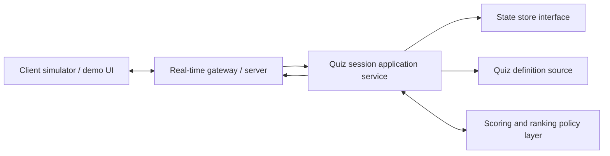

# ARCHITECTURE_PRINCIPLES.md

## Architecture And Design Principles

## Status

This is the current stable architecture baseline for the project. It should change more slowly than the working logs and should only be updated when architecture direction or durable assumptions materially change.

## Related Records

- Stable principles live here.
- Explicit architecture tradeoffs should be summarized in `docs/architecture/TRADEOFFS.md`.
- Working discussion, options, assumptions, and session-by-session architecture notes should go in `docs/architecture/`.
- Architecture session logs should be stored under `docs/architecture/logs/`.

## Purpose

This document defines the stable architectural direction for the challenge solution. It explains the intended component boundary, core runtime responsibilities, durable principles, and the scaling path that should guide implementation and later module design.

## Solution Boundary

The implementation target is one core real-time component: a backend real-time quiz session service.

This component owns:

- joining a quiz session by `quizId`
- issuing participant identity and reconnect token material
- tracking active participants in a session
- receiving answer submissions
- validating submissions against quiz or question data
- calculating score updates
- computing leaderboard state
- broadcasting score and leaderboard updates in real time
- handling limited reconnect behavior
- returning clear errors for invalid actions

This component does not own:

- full authentication and authorization
- user profiles or account lifecycle
- quiz authoring or admin tooling
- rich frontend behavior
- long-term analytics or reporting pipelines
- full production deployment infrastructure

## Stable Assumptions

The current stable assumptions are:

- the implemented component is backend-first, with surrounding product pieces mocked as needed
- leaderboard scope is per quiz session
- participant identity is server-issued and session-scoped, not authenticated user identity
- reconnect remains in scope, but only as limited session recovery
- one active connection is allowed per participant within a session
- later valid reconnects replace prior active connections for the same participant
- each participant may answer each question only once
- subsequent answers for the same participant-question pair are rejected by the server
- incorrect answers always score zero
- correct answers score positively, and faster correct answers score higher
- speed is measured only from server-recorded broadcast time to server-recorded submission receive time
- leaderboard ordering must be implemented through a replaceable ranking policy
- state access must go through a clear storage interface
- the first storage implementation may be in-memory, but the architecture must support a future scalable backing store

## Primary Principles

### 1. Submission-first scope control

Build the smallest component that fully demonstrates the acceptance criteria and can be explained clearly in a short demo.

### 2. Clear separation of concerns

Split the solution into:

- transport and connection handling
- application/domain services
- session state management
- scoring and ranking logic
- observability and error handling

### 3. Real-time events as explicit contracts

All client-server interactions should use well-defined event names and payloads so behavior is testable and future changes are manageable.

### 4. Replaceable state access

For the coding challenge implementation, in-memory state is acceptable only behind a clear storage interface. Storage choice must not leak deeply into the domain model.

### 5. Deterministic core logic

Scoring, ranking, and session transitions should be implemented as deterministic logic separate from the transport layer to simplify testing.

For this type of quiz or game flow, deterministic server-side behavior is a core principle: equal inputs and server-observed timing should always produce the same score, ranking, and session outcome.

### 6. Reliability over feature breadth

Prefer robust handling of a narrow scope over adding extra product features such as authentication, timers, or moderation unless required for the demo.

### 7. Observability from the start

Even for a small challenge implementation, include a plan for logs, metrics, and failure diagnosis so the design discussion is credible.

### 8. Replaceable policy boundaries

Behavior that is likely to evolve, such as ranking policy and scoring formula, should be isolated behind replaceable policy boundaries rather than embedded deeply in session lifecycle code.

## Proposed High-Level Architecture

- Client simulator or demo client
- Real-time gateway/server
- quiz session application service
- scoring and ranking policy layer
- session or participant state store interface
- mocked quiz/question source

## Component Roles

### Real-time gateway/server

Owns connection lifecycle, event intake, payload validation at the boundary, and outbound event delivery. It should not own scoring or ranking rules.

### Quiz session application service

Owns session lifecycle, participant lifecycle, join or reconnect handling, submission orchestration, and coordination between state, quiz data, and scoring logic.

### Scoring and ranking policy layer

Owns deterministic score calculation and leaderboard ordering. It should remain pure or near-pure where possible.

### State store interface

Owns persistence or retrieval of live session and participant state through an abstraction that can be backed by in-memory storage first and replaced later.

### Quiz definition source

Provides quiz and question data. For the challenge implementation, this may be mocked or seeded.

## Current Implementation Stack Direction

The current implementation stack direction for the challenge build is:

- Node.js LTS runtime
- TypeScript codebase
- Fastify as the HTTP application shell
- WebSocket transport using explicit JSON command and event envelopes
- `@fastify/websocket` as the first integration path for the WebSocket boundary
- in-memory state and mocked quiz-definition access behind interfaces
- `node:test` for the first unit-test guard rails
- GitHub Actions for the first CI baseline

## Core Runtime Rules

### Identity and reconnect

- `participantId` is server-issued
- reconnect uses a server-issued opaque token
- reconnect is session-scoped, not full account recovery
- latest valid connection replaces the previous active connection for the same participant
- participant state stays attached to participant identity, not to a socket

### Answer submission

- one answer per participant per question
- first accepted submission counts
- subsequent submissions are rejected by the backend
- the client should prevent repeat submission, but server enforcement remains authoritative

### Scoring and timing

- incorrect answers always score zero
- correct answers score positively
- faster correct answers score higher
- speed measurement must use server-recorded broadcast time and server-recorded receive time only
- client timestamps must not influence competitive scoring

### Leaderboard ranking

- ranking is implemented through a replaceable ranking policy
- current default policy ranks by total score descending
- current default fallback tie-break is earlier participant creation order

## State And Scaling Direction

The architecture should support this path:

1. initial implementation with in-memory storage behind a clear interface
2. later migration to a scalable shared or durable state store
3. eventual multi-instance live session handling through shared state and coordination

Important scaling implication:

- one application instance may host many sessions
- while live session state is only process-local, a given active session is effectively tied to one instance at a time
- safe multi-instance handling of the same live session requires shared state and coordination

## Reliability And Observability Expectations

The implementation should be designed so later module work can support:

- explicit handling of invalid or duplicate submissions
- deterministic reconnect replacement behavior
- structured logging around join, reconnect, submission, scoring, and leaderboard updates
- health visibility for local development and production-oriented discussion
- diagnosable failure paths rather than silent state corruption

## Remaining Open Details

The following are still intentionally open and should be resolved later without changing the current architecture boundary:

- exact speed-based scoring formula
- exact version pins and project scripts for the chosen stack
- exact event names and payload schema
- exact future scalable backing store choice

## Scalability Direction

Future production evolution should support:

- stateless application nodes
- shared session state or event stream
- scalable fan-out for leaderboard updates
- persistent storage for quiz definitions and result history
- metrics and tracing for diagnosis under load

## Non-Goals For Initial Implementation

- full user authentication
- long-term persistence
- complex admin workflows
- rich frontend application
- anti-cheat mechanisms beyond simple validation
