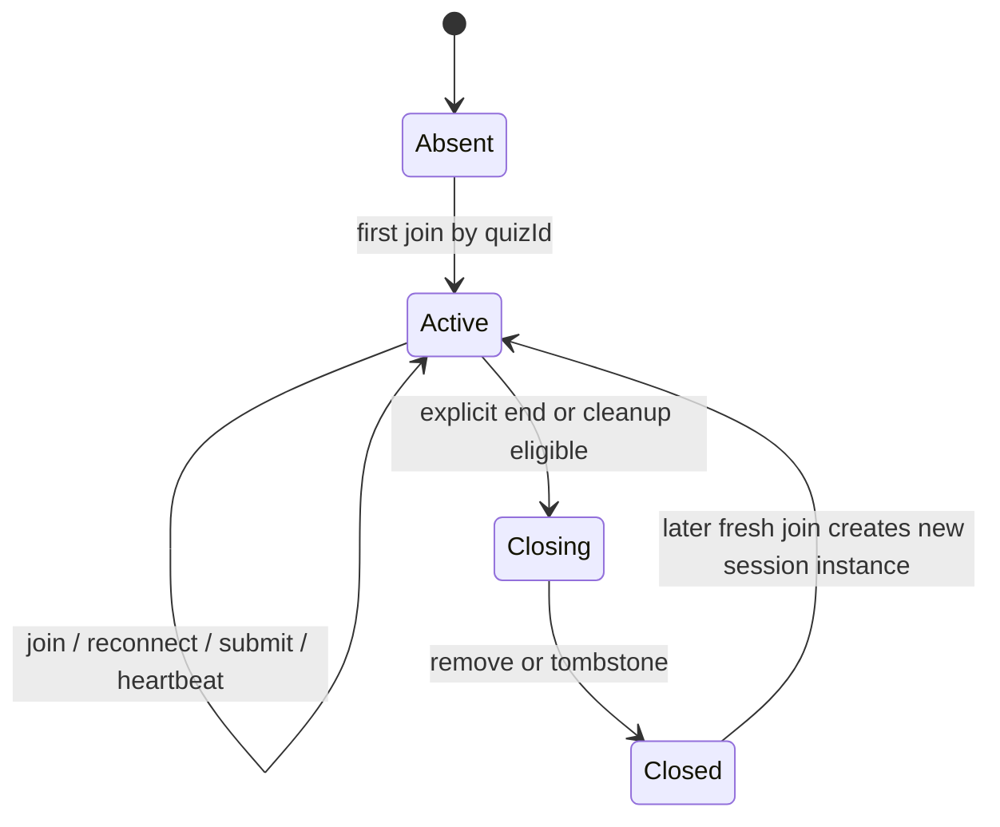
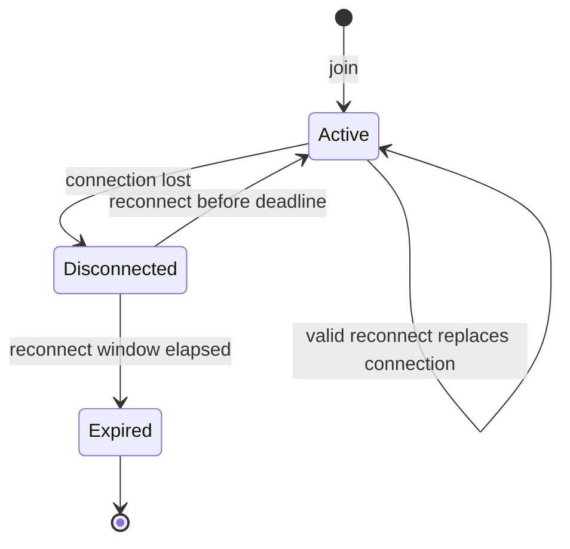

# quiz-session.md

## Module Design: Quiz Session

## Status

Stable first-pass module contract. This document defines the current ownership and lifecycle rules for live quiz session state, participant identity, reconnect retention, and cleanup. Later transport and protocol work may refine names and payloads, but should not change these ownership rules without an explicit design update.

## Purpose

Own the live quiz session runtime for a single active quiz run keyed by `quizId`.

This module is responsible for:

- resolving or creating the active live session for a `quizId`
- issuing server-owned participant identity and reconnect credentials
- tracking participant membership and active connection ownership
- preserving participant state across disconnects for a bounded reconnect window
- exposing authoritative session state needed by submission, scoring, and leaderboard flows
- deciding when a live session remains active, becomes cleanup-eligible, and closes

This module is not responsible for:

- transport-level payload validation and socket I/O details
- scoring formula details or leaderboard ranking policy details
- full user authentication or account identity
- quiz authoring or persistent result history
- observability presentation beyond defining the important lifecycle transitions to log

## Relationship To Other Modules

- `realtime-transport` should translate client events into module operations and map module results back into outbound events.
- `scoring-and-leaderboard` should use session state owned here but keep scoring and ranking rules outside this module.
- `observability-and-operations` should attach logging, metrics, and cleanup visibility around the state transitions defined here.

## Core Entities

### Quiz Session

A live quiz session is the authoritative state container for one active run of a `quizId`.

Key fields:

- `quizId`: external join key used by clients
- `sessionInstanceId`: server-issued internal identifier for one live run of a `quizId`
- `status`: current lifecycle state for the live session
- `quizDefinitionRef`: reference to the quiz or question source
- `phase` and current question context: enough runtime state to know what the participant may currently answer
- `participants`: participant registry for the active run
- `createdAt`, `lastActivityAt`, and cleanup-relevant timestamps
- `version`: storage-level version for atomic updates or optimistic concurrency

### Participant

A participant is session-scoped and server-owned. It is not an authenticated user identity.

Key fields:

- `participantId`: server-issued identifier scoped to the session instance
- `displayName`: optional client-provided label, not an authoritative identity key
- `reconnectToken`: opaque server-issued resume credential scoped to the session
- `connectionId`: current active connection owner, if any
- `state`: current participant lifecycle state
- `joinOrder`: monotonically increasing order used for deterministic fallback behavior
- `score` and answer-tracking fields needed by scoring and leaderboard flows
- `joinedAt`, `disconnectedAt`, and `reconnectUntil`

## Suggested State Shape

Keep the first implementation centered on:

- `SessionAggregate`: ids, status, phase or current-question context, participant registry, timestamps, version
- `ParticipantRecord`: ids, reconnect token, connection owner, lifecycle state, join order, score or answer markers, timestamps
- small abstractions for `Clock`, `IdGenerator`, and reconnect token generation so unit tests stay deterministic

Initial scaffold phase set:

- `lobby`
- `question_open`
- `question_closed`
- `finished`

## Session Lifecycle Model

Lifecycle rules:

- `Absent` is the implicit state before any active live session exists for a `quizId`.
- `Active` means the live session can accept joins, reconnects, and runtime operations.
- `Closing` is an internal cleanup state. New joins and reconnects should no longer bind to that session instance.
- `Closed` is terminal for that session instance. The first implementation may delete closed sessions immediately instead of retaining a tombstone.
- A new join for the same `quizId` after closure creates a new `sessionInstanceId`.

Cleanup eligibility rules:

- A session remains `Active` while at least one participant has an active connection.
- A session may also remain `Active` with zero active connections while one or more participants are still within their reconnect retention window.
- A session becomes cleanup-eligible only when there are no active connections and no reconnect-eligible participants, or when the quiz run is explicitly ended.
- Cleanup should transition through `Closing` so the store can reject late mutations cleanly.

## Participant Lifecycle Model

Participant rules:

- A participant enters `Active` when the server accepts a join or valid reconnect and binds the current connection.
- `Disconnected` means the participant has no active connection but retains score, answer history, and reconnect rights until `reconnectUntil`.
- `Expired` means reconnect rights ended. The participant state no longer qualifies the session for retention.
- A valid reconnect never creates a second active participant identity. It reactivates the existing participant and replaces the prior connection ownership.
- A stale disconnect from an older connection must not clear the newer active connection owner.

## Join And Reconnect Rules

- There may be at most one active live session instance per `quizId`.
- The first join for a `quizId` lazily creates the active session.
- Additional joins while the session is `Active` attach new participants to the same session instance.
- Late joins are allowed while a session is `Active`. New participants begin with the current session snapshot and zero prior score.
- Reconnect requires the `quizId` and a valid session-scoped opaque reconnect token.
- Invalid or expired reconnect attempts are rejected. The client may fall back to a fresh join as a new participant.
- Display names are not unique identifiers. Two participants may share the same display name.
- One participant may have only one active connection at a time. The latest valid reconnect wins.

## State Ownership

This module should be treated as the owner of these runtime concerns:

- session existence and active-session resolution by `quizId`
- participant registry and participant lifecycle state
- connection ownership and reconnect eligibility
- session-level phase or current-question reference needed to validate whether submissions are timely
- participant score totals and per-question answer markers as live state, even when updated by separate scoring logic
- cleanup-relevant timestamps and close reasons

This module should expose authoritative session snapshots to downstream layers, but it should not embed transport payload shapes or ranking policy details.

## Module Operations

| Operation | Input Intent | Result Intent | Notes |
| --- | --- | --- | --- |
| `joinSession` | join by `quizId` with optional display name and current connection | participant credentials plus current session snapshot | creates the live session lazily if none exists |
| `reconnectParticipant` | reclaim session-scoped identity using `quizId`, reconnect token, and current connection | rebound participant plus current session snapshot | replaces any prior active connection owner |
| `disconnectParticipant` | report connection loss for a known participant and connection | participant marked disconnected if the connection still owns that participant | must be idempotent and ignore stale disconnects |
| `getSessionSnapshot` | read authoritative session state for downstream orchestration | session snapshot | should not require transport-specific knowledge |
| `expireOrCloseSession` | internal cleanup path based on timestamps or explicit end reason | session closed or retained | may be driven by a sweeper, lifecycle hook, or command handler |

## Implementation Handoff

Build this module in this order:

1. Define the types and interfaces first: aggregate records, store interface, clock or id or token abstractions, and transport-neutral result shapes.
2. Add unit tests for join, reconnect, stale disconnect, expiry or cleanup, and fresh-session-after-close behavior.
3. Implement `joinSession`, then `reconnectParticipant`, then `disconnectParticipant`, then `expireOrCloseSession`.
4. Keep transport and scoring as adapters over these interfaces instead of embedding their logic here.

## Store Interface Expectations

The storage boundary should stay session-oriented instead of socket-oriented.

Minimum required capabilities:

- resolve the active session instance for a `quizId`
- create a new live session instance when none exists
- load and persist the full session aggregate with atomic session-scoped mutation semantics
- resolve reconnect credentials to the correct participant within the session boundary
- mark disconnect, reconnect, expiry, and close transitions as part of the same authoritative session update
- sweep or remove cleanup-eligible closed sessions

The important design requirement is atomicity at the session boundary. The first implementation may satisfy this with any simple single-writer or atomic-update approach. A future shared store may use a different concurrency-safe mechanism. The module contract should not depend on storage-specific details beyond that guarantee.

## Required Invariants

- at most one active live session instance exists for a `quizId`
- `participantId` is server-issued and scoped to one session instance
- reconnect never transfers state across session instances
- a participant's score and answer history are attached to the participant identity, not to a connection
- a participant has at most one active connection owner at a time
- stale disconnect handling cannot evict the current active connection owner
- expired participants cannot be reactivated without a fresh join
- session cleanup cannot remove a live session that still has an active connection or reconnect-eligible participant

## Important Error Cases

- join rejected because the `quizId` cannot resolve to a valid quiz definition
- reconnect rejected because the token is invalid, expired, or belongs to a different session instance
- disconnect received for an unknown or already-replaced connection
- mutation rejected because the session instance is already `Closing` or `Closed`
- cleanup racing with reconnect or submission and needing atomic conflict handling

## Observability Notes

The implementation should log or emit metrics around:

- session creation and closure
- participant join, disconnect, reconnect, and expiry
- stale disconnect detection
- reconnect rejection and cleanup-trigger reasons
- active participant count and retained disconnected participant count

## Open Questions

- exact reconnect retention TTL and inactive-session cleanup thresholds `[needs verification]`
- whether the first implementation should delete closed sessions immediately or keep a short-lived tombstone `[questionable]`
- whether additional non-player-facing phases are needed beyond the initial scaffold set `[questionable]`
- exact mapping from these module results to transport event names and payload schemas `[needs verification]`
