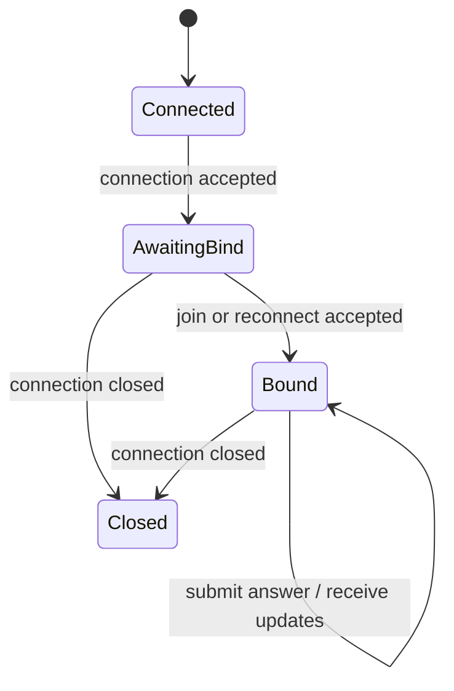

# realtime-transport.md

## Module Design: Real-Time Transport

## Status

Stable first-pass module contract. This document defines the transport boundary between client connections and the backend quiz component. It settles connection state, command and event shapes, validation responsibilities, and the mapping between transport activity and application-layer operations.

## Purpose

Own the connection-facing boundary for real-time quiz interactions.

This module is responsible for:

- accepting and closing client connections
- assigning a transport-level `connectionId`
- validating inbound command envelopes and payload shape
- enforcing which commands are allowed before and after session binding
- routing valid commands to the application-layer session and answer services
- serializing outbound events and correlation fields
- translating application results and failures into stable transport events

This module is not responsible for:

- deciding session lifecycle rules or reconnect validity rules
- deciding scoring or ranking behavior
- storing authoritative session or participant state
- embedding transport-specific callbacks or framework-specific control flow into the core contracts

## Selection Guidance

Keep the transport choice abstract for now. Prefer a transport approach with:

- simple local development
- low ceremony at the boundary
- clear request or event semantics
- straightforward testing and mocking
- easy mapping to the session and scoring interfaces

## Relationship To Other Modules

- `quiz-session` owns participant identity, reconnect eligibility, and session snapshots.
- `scoring-and-leaderboard` owns answer evaluation, score changes, and leaderboard ordering.
- `observability-and-operations` should attach transport logs, connection counts, and boundary-error visibility around the flows defined here.

## Connection Lifecycle Model

Lifecycle rules:

- Every accepted transport connection gets a unique `connectionId`.
- A new connection starts in `AwaitingBind`.
- Only session-binding commands are allowed in `AwaitingBind`.
- After a successful join or reconnect, the connection enters `Bound`.
- Connection close is a transport lifecycle event, not a client command.
- If a replaced older connection closes later, the transport should still report the disconnect, and the `quiz-session` module must decide whether it is stale.

## Envelope Shape

Use a simple, transport-neutral envelope for all client-server messages.

Inbound command envelope:

- `command`: stable command name
- `requestId`: optional client-generated correlation id
- `payload`: command-specific body

Outbound event envelope:

- `event`: stable event name
- `requestId`: echoed when the event is the direct result of a command
- `payload`: event-specific body

The first implementation does not need transport-level deduplication by `requestId`. It should still preserve `requestId` for tracing and client-side correlation.

## Inbound Commands

Use these command names:

- `session.join`
- `session.reconnect`
- `answer.submit`

Rules:

- `session.join` is allowed only while the connection is unbound.
- `session.reconnect` is allowed only while the connection is unbound.
- `answer.submit` is allowed only while the connection is bound to a participant.
- There is no explicit `disconnect` client command in the first implementation.

Minimum payload expectations:

- `session.join`: `quizId`, optional `displayName`
- `session.reconnect`: `quizId`, `reconnectToken`
- `answer.submit`: answer reference plus enough question context to identify what the participant is answering

## Outbound Events

Use these event names:

- `session.joined`
- `session.reconnected`
- `session.snapshot`
- `participant.presence.updated`
- `participant.score.updated`
- `leaderboard.updated`
- `command.rejected`

Event intent:

- `session.joined` and `session.reconnected` acknowledge successful binding and return participant credentials plus the current session snapshot.
- `session.snapshot` is the canonical full-state sync event when the client needs authoritative state.
- `participant.presence.updated` communicates join, disconnect, reconnect, and expiry visibility to interested clients.
- `participant.score.updated` communicates an actor or participant score change when an answer is accepted.
- `leaderboard.updated` communicates the ordered leaderboard view after a scoring change.
- `command.rejected` communicates a clear application-level rejection for the triggering command.

## Session Snapshot Boundary

The canonical snapshot shape returned through transport should include:

- `session`: `quizId`, `sessionInstanceId`, status, phase, current question reference if any, version
- `self`: participant identity, display name, participant state, current score, reconnect token when appropriate
- `participants`: lightweight participant presence summary
- `leaderboard`: ordered score summary suitable for direct rendering

Keep the snapshot shape stable across join, reconnect, and later sync events. Downstream handlers may omit sections only when the event is intentionally incremental instead of a full snapshot.

## Design Rules

- validate envelope shape and required payload fields at the boundary
- reject commands that are not allowed for the current connection state
- normalize boundary failures into stable application-facing error codes
- keep command and event names stable and human-readable
- keep transport handlers thin; mapping and orchestration should call application interfaces instead of embedding domain rules

## Validation And Error Rules

Transport-level rejection should cover:

- unknown command name
- missing or malformed required fields
- command not allowed for the current connection state
- oversized or obviously invalid display name or answer payload

Use these error codes as the first-pass set:

- `invalid_payload`
- `unknown_command`
- `command_not_allowed`
- `not_bound`
- `join_rejected`
- `reconnect_rejected`
- `answer_rejected`
- `internal_error`

Validation should stop at shape, presence, and obvious boundary rules. Quiz validity, reconnect legitimacy, answer acceptance, and duplicate-answer behavior belong to the application layer.

## Idempotency And Ordering Rules

- `session.join` is not idempotent and should not be retried on an already bound connection.
- `session.reconnect` may return the current bound snapshot if the same participant is already successfully bound on that connection.
- `answer.submit` should be forwarded at most once per received command envelope; duplicate-answer behavior is then decided by the application layer.
- Outbound events for one accepted command should be emitted in a stable order: direct acknowledgement or rejection first, then any resulting state update events.

## Suggested Interface Shape

Keep the first implementation centered on:

- `ConnectionContext`: `connectionId`, bind state, bound `participantId` if any, bound `quizId` if any
- `TransportCommandHandler`: parse, validate, route, and map results to outbound events
- application-facing interfaces for session binding, answer submission, and snapshot retrieval
- a serializer or mapper layer that turns application results into transport envelopes

## Implementation Handoff

Build this module in this order:

1. Define the envelope types, command names, event names, `ConnectionContext`, and application-facing interfaces first.
2. Add unit tests for invalid payload rejection, unbound-vs-bound command rules, join or reconnect success, close-triggered disconnect forwarding, and result-to-event mapping.
3. Implement `session.join`, then `session.reconnect`, then `answer.submit`, then connection-close handling.
4. Keep the transport adapter thin and keep session or scoring decisions behind interfaces.

## Open Design Questions

- whether `participant.score.updated` is needed separately once the `leaderboard.updated` payload is finalized `[questionable]`
- exact snapshot field list for current-question context and answer submission payloads `[needs verification]`
- whether a client-triggered `session.snapshot` request command is needed for the first implementation `[questionable]`
