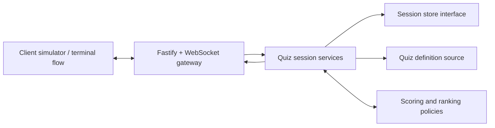
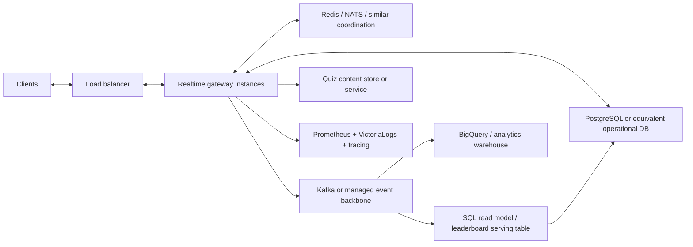

# SYSTEM_DESIGN.md

## System Design Summary

## Executive Summary

This submission implements one core component: a backend real-time quiz session service.

The implemented service owns:

- joining a quiz by `quizId`
- issuing session-scoped participant identity and reconnect tokens
- validating `answer.submit` commands
- scoring accepted answers
- computing and broadcasting session-scoped leaderboard updates
- surfacing progression state through transport-visible `session.snapshot` events

It intentionally does not implement:

- a full frontend
- user authentication
- quiz authoring or moderation tooling
- long-term analytics pipelines
- production deployment infrastructure

This boundary was chosen because it is the smallest component that still demonstrates the challenge’s real-time behavior clearly.

## Implemented Runtime Architecture

## Component Responsibilities

| Component | Responsibility |
| --- | --- |
| Client simulator or terminal flow | sends commands and renders session, score, and leaderboard state |
| Fastify + WebSocket gateway | accepts connections, validates envelopes, enforces bind-state rules, and emits events |
| Quiz session services | own join, reconnect, disconnect, progression, answer orchestration, and snapshot state |
| Scoring and ranking policies | compute accepted-answer score changes and deterministic leaderboard ordering |
| Session store interface | hides authoritative live session persistence behind a replaceable boundary |
| Quiz definition source | supplies quiz structure and accepted-answer data |

## Key Runtime Flows

### Join

1. A client connects to `/ws`.
2. The client sends `session.join` with `quizId` and optional `displayName`.
3. Transport validates the envelope and current connection state.
4. The session service resolves or creates the active session and creates the participant binding.
5. Transport returns `session.joined` with the authoritative session snapshot and binds the connection.

### Answer Submission

1. A bound client sends `answer.submit`.
2. Transport checks that the connection is bound and the payload is well-formed.
3. The answer flow validates session phase, active question, participant membership, and duplicate-answer rules.
4. The scoring policy resolves correctness from quiz-definition answer data and applies the current server-observed timing formula.
5. The updated score and leaderboard are written to authoritative session state.
6. Transport emits `participant.score.updated` and `leaderboard.updated` to the submitter and fans out session-scoped copies to other active participants.

### Progression

1. Internal progression closes the active question or advances to the next question.
2. The authoritative session snapshot changes phase and current-question context.
3. Transport fans out `session.snapshot` so later submissions are validated against the right server-side state.

## Current Technology Choices

| Area | Choice | Rationale |
| --- | --- | --- |
| Runtime | Node.js `24.x` | consistent local setup and CI baseline |
| Language | TypeScript | explicit contracts and safer protocol changes |
| Server shell | Fastify | small surface area and clear composition |
| Realtime protocol | WebSocket via `@fastify/websocket` | explicit command and event envelopes without extra framework abstraction |
| Testing | `node:test` plus headless WebSocket harness | low dependency overhead with meaningful end-to-end coverage |
| CI | GitHub Actions | simple merge gate for install, typecheck, and tests |
| State and quiz data | in-memory session store plus mocked quiz definitions behind interfaces | keeps the challenge implementation small while preserving replacement seams |

## Why This Design Is Maintainable

The implementation is deliberately split along stable seams:

- transport and connection rules are separate from session or scoring logic
- session state access is hidden behind a storage interface
- scoring and leaderboard ordering are isolated behind replaceable policies
- progression is separated from public command handling
- verification includes both focused unit tests and a real WebSocket integration harness

This keeps the current challenge implementation easy to explain while leaving obvious migration points for production systems.

## Reliability Model

The current runtime favors deterministic correctness over feature breadth:

- one answer per participant per question
- server-observed timing only
- explicit rejection for duplicate, late, closed-phase, and wrong-question submissions
- latest valid reconnect replaces the older active connection
- passive fanout stays session-scoped

These rules reduce ambiguity and make the behavior much easier to test and reason about than a broader but less controlled implementation.

## Performance And Scale Discussion

### Current Limits

The current implementation is a single-process service with in-memory state. That is acceptable for the challenge, but it creates obvious scale limits:

- a live session is effectively pinned to one process
- process restarts lose session state
- all leaderboard calculation is local to one node
- transport fanout only works inside that one runtime

### Likely Production Topology

### Storage Path

For a larger deployment, the in-memory session store should be replaced with a shared operational database. A practical first choice would be PostgreSQL or an equivalent relational store because the system needs:

- authoritative participant and session state
- reconnect-safe persistence
- auditable score history
- deterministic ordering and transactional updates

If reconnect ownership, session leasing, or cross-instance presence becomes latency-sensitive, Redis or a similar low-latency coordination layer can complement the primary database rather than replace it.

### Messaging And Realtime Fanout

At larger scale, multi-instance delivery needs shared coordination. Plausible options include:

- Redis pub-sub for simpler shared fanout
- NATS for lightweight low-latency messaging
- Kafka for stronger event-stream durability and downstream consumers
- equivalent managed messaging services in cloud-hosted deployments

The right choice depends on whether the primary need is fast transient fanout, durable event replay, or both.

### Leaderboard Serving

Live leaderboard reads should not come from an analytics warehouse. For serving traffic, a better approach is:

- authoritative answer acceptance in the application service
- incremental aggregation into an operational SQL-backed read model
- near-real-time ranking updates driven either inline or from a stream consumer

That means a serving-side SQL table or read model for leaderboard retrieval, while BigQuery remains a downstream analytics sink rather than the serving path.

### Quiz Content

The mock quiz-definition source is enough for the challenge. In production, quiz content would usually move to:

- a dedicated content service
- a relational content store
- or a document store if authoring and content evolution require more flexible structures

The important architectural point is that quiz content is already behind a replaceable boundary.

### Availability And Failure Handling

A production path would also need:

- stateless gateway instances behind a load balancer
- shared session ownership or leasing
- idempotent-ish downstream event handling where practical
- controlled reconnect retention and cleanup policies
- graceful degradation when fanout, storage, or read-model updates fail

The challenge implementation intentionally stops short of this infrastructure, but the boundaries are chosen so those additions would not require rewriting the full runtime shape.

## Observability And Operations

The challenge implementation keeps observability lightweight in code:

- `GET /health` for a basic liveness signal
- structured runtime logs for joins, reconnects, accepted answers, rejections, leaderboard updates, and progression snapshot fanout

A credible production path would usually add:

- Prometheus for metrics
- centralized logs such as VictoriaLogs or an equivalent log platform
- distributed tracing
- BigQuery or another warehouse for longer-horizon analytics

The current code deliberately does not embed that infrastructure so the solution stays submission-sized.

## Verification Surfaces

The repository gives reviewers three distinct ways to inspect the component:

- `npm run simulate:game`
  - black-box check against a separately running `npm run dev` server
- `npm run simulate:random-game`
  - local-only multi-round terminal narrative with leaderboard output throughout
- `npm run test:integration`
  - deterministic headless end-to-end proof across richer multi-client scenarios

This combination replaces the need for a dedicated frontend while still giving a credible runtime story.

## AI Collaboration In Design

AI assistance was used throughout planning and design, but those outputs were treated as drafts to be reviewed, refined, and tested. The condensed reviewer summary is in [AI_COLLABORATION.md](AI_COLLABORATION.md), and the detailed diary trail is in [../docs/ai-usage/](../docs/ai-usage/).

## Canonical References

- [../docs/ARCHITECTURE_PRINCIPLES.md](../docs/ARCHITECTURE_PRINCIPLES.md)
- [../docs/architecture/TRADEOFFS.md](../docs/architecture/TRADEOFFS.md)
- [../docs/modules/quiz-session.md](../docs/modules/quiz-session.md)
- [../docs/modules/realtime-transport.md](../docs/modules/realtime-transport.md)
- [../docs/modules/scoring-and-leaderboard.md](../docs/modules/scoring-and-leaderboard.md)
- [../docs/modules/observability-and-operations.md](../docs/modules/observability-and-operations.md)
