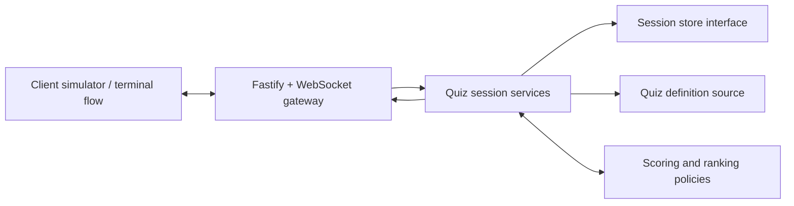
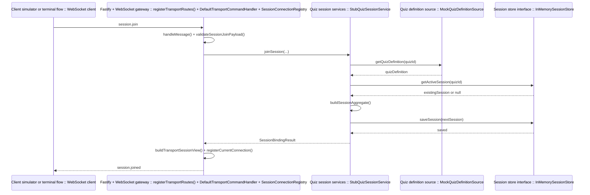
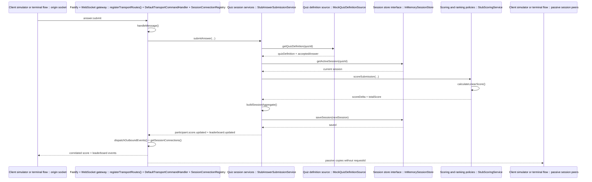
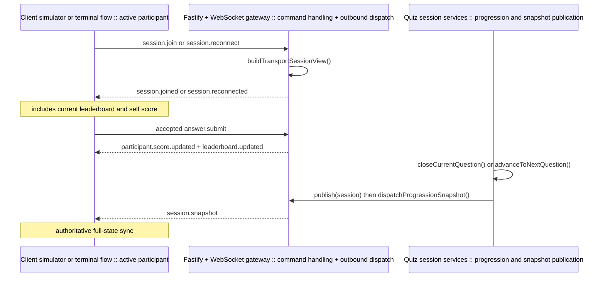
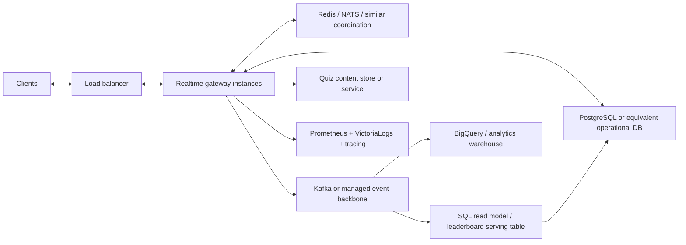

# SYSTEM_DESIGN.md

## System Design Summary

## Executive Summary

This submission implements one core component: a backend real-time quiz session service.

The implemented service owns:

- joining a quiz by `quizId`
- issuing session-scoped participant identity and reconnect tokens
- validating `answer.submit` commands
- scoring accepted answers
- computing and broadcasting session-scoped leaderboard updates
- surfacing progression state through transport-visible `session.snapshot` events

It intentionally does not implement:

- a full frontend
- user authentication
- quiz authoring or moderation tooling
- long-term analytics pipelines
- production deployment infrastructure

This boundary was chosen because it is the smallest component that still demonstrates the challenge’s real-time behavior clearly.

## Implemented Runtime Architecture

## Component Responsibilities

| Component | Responsibility |
| --- | --- |
| Client simulator or terminal flow | sends commands and renders session, score, and leaderboard state |
| Fastify + WebSocket gateway | accepts connections, validates envelopes, enforces bind-state rules, and emits events |
| Quiz session services | own join, reconnect, disconnect, progression, answer orchestration, and snapshot state |
| Scoring and ranking policies | compute accepted-answer score changes and deterministic leaderboard ordering |
| Session store interface | hides authoritative live session persistence behind a replaceable boundary |
| Quiz definition source | supplies quiz structure and accepted-answer data |

## Key Runtime Flows

### Join

1. A client connects to `/ws`.
2. The client sends `session.join` with `quizId` and optional `displayName`.
3. Transport validates the envelope and current connection state.
4. The session service resolves or creates the active session and creates the participant binding.
5. Transport returns `session.joined` with the authoritative session snapshot and binds the connection.

### Answer Submission

1. A bound client sends `answer.submit`.
2. Transport checks that the connection is bound and the payload is well-formed.
3. The answer flow validates session phase, active question, participant membership, and duplicate-answer rules.
4. The scoring policy resolves correctness from quiz-definition answer data and applies the current server-observed timing formula.
5. The updated score and leaderboard are written to authoritative session state.
6. Transport emits `participant.score.updated` and `leaderboard.updated` to the submitter and fans out session-scoped copies to other active participants.

### Progression

1. Internal progression closes the active question or advances to the next question.
2. The authoritative session snapshot changes phase and current-question context.
3. Transport fans out `session.snapshot` so later submissions are validated against the right server-side state.

## Concrete Runtime Flow Charts

These diagrams use the actual modules and function names from the current implementation. Each lane is labeled as `Component :: concrete module`, and the specific function calls are shown in the messages so the diagrams stay aligned with the component table above without over-splitting one module into many lanes.

### Join And Initial Snapshot

### Accepted Answer To Score And Leaderboard Fanout

### How Clients Get Current Score And Leaderboard

There is no standalone transport command such as `leaderboard.get` in the current implementation. Clients observe score and leaderboard state through these existing paths:

## Current Technology Choices

| Area | Choice | Rationale |
| --- | --- | --- |
| Runtime | Node.js `24.x` | consistent local setup and CI baseline |
| Language | TypeScript | explicit contracts and safer protocol changes |
| Server shell | Fastify | small surface area and clear composition |
| Realtime protocol | WebSocket via `@fastify/websocket` | explicit command and event envelopes without extra framework abstraction |
| Testing | `node:test` plus headless WebSocket harness | low dependency overhead with meaningful end-to-end coverage |
| CI | GitHub Actions | simple merge gate for install, typecheck, and tests |
| State and quiz data | in-memory session store plus mocked quiz definitions behind interfaces | keeps the challenge implementation small, avoids standing up Redis, Kubernetes, ingress, and database infrastructure during the challenge, and still preserves replacement seams |

## Why This Design Is Maintainable

The implementation is deliberately split along stable seams:

- transport and connection rules are separate from session or scoring logic
- session state access is hidden behind a storage interface
- scoring and leaderboard ordering are isolated behind replaceable policies
- progression is separated from public command handling
- verification includes both focused unit tests and a real WebSocket integration harness

This keeps the current challenge implementation easy to explain while leaving obvious migration points for production systems.

## Reliability Model

The current runtime favors deterministic correctness over feature breadth:

- one answer per participant per question
- server-observed timing only
- explicit rejection for duplicate, late, closed-phase, and wrong-question submissions
- latest valid reconnect replaces the older active connection
- passive fanout stays session-scoped

These rules reduce ambiguity and make the behavior much easier to test and reason about than a broader but less controlled implementation.

## Performance And Scale Discussion

### Current Limits

The current implementation is a single-process service with in-memory state. That is acceptable for the challenge, but it creates obvious scale limits:

- a live session is effectively pinned to one process
- process restarts lose session state
- all leaderboard calculation is local to one node
- transport fanout only works inside that one runtime

This was also a deliberate delivery choice. For the challenge, the goal was to prove the real-time session logic first without spending most of the implementation budget on Redis, Kubernetes, ingress, database provisioning, or other production infrastructure.

### Likely Production Topology

### Scale Case 1: Millions Of Users Across Thousands Of Games

This is the more common large-scale case. The key idea is to shard by live session, not by individual socket.

#### Kubernetes Routing And Session Ownership

In a Kubernetes deployment, a plain `Service` or ingress layer does not understand `quizId` inside WebSocket frames. In practice, a cleaner pattern is:

- clients connect through a load balancer or ingress to any gateway pod
- the gateway pod keeps the WebSocket connection
- on `session.join`, the gateway resolves or claims a session owner for that `quizId`
- subsequent mutating commands for that session are forwarded internally to the owner

The session-owner mapping can live in Redis as a leased directory, for example:

- `session:{sessionId}:owner -> worker-id`
- set with `SET NX EX` or a similar leased-claim pattern
- renewed periodically by the owning worker

A practical worker-selection strategy is rendezvous hashing or another stable hash over the active worker set, with Redis used as the authoritative lease record. In Kubernetes terms, the gateway forwards to the chosen owner over an internal service address such as gRPC or HTTP inside the cluster.

This approach avoids requiring NGINX, Envoy, or another proxy layer to understand session routing inside already-established WebSocket connections.

#### Why Not Just Let The Database Serialize Everything

That is possible, especially as an intermediate production step:

- store session state in PostgreSQL
- use row locks or optimistic concurrency
- let any gateway update the same session through the database

The problem is that the database then becomes the serialization point for hot sessions. At moderate scale this can be acceptable, but under heavier contention it leads to:

- row-lock congestion
- retries or lock waits
- noisier tail latency
- a database that is acting like a distributed lock manager

For many sessions at once, explicit session ownership is usually a cleaner scaling model than using the operational database as the main concurrency control surface.

#### Realtime Ranking With Redis

For the live leaderboard in this many-session case, Redis is a practical realtime serving structure:

- keep durable participant or answer state in PostgreSQL
- maintain a per-session Redis sorted set keyed by total score
- read top `K` standings from Redis
- read an individual participant's rank from Redis

Because a single owner processes writes for a session, leaderboard updates remain linearized for that session. Redis gives efficient incremental rank maintenance, so the application does not need to full-sort the leaderboard on every accepted answer.

BigQuery or another warehouse remains downstream-only for analytics, not the live serving path.

### Scale Case 2: One Hotspot Game With Millions Of Connections

This is a different problem. A single-owner-per-session model becomes a bottleneck if one game itself is massive.

For that hotspot case, the system should switch from session-sharded processing to participant-sharded processing for that one game.

#### Hotspot Processing Model

- gateways still accept sockets on any pod
- participants are assigned to answer-processing shards by participant hash
- all shards read the same current question epoch from Redis or another low-latency control store
- duplicate prevention is enforced per `participantId + questionId`, either by shard ownership or by an atomic Redis key such as `SETNX answer:{sessionId}:{questionId}:{participantId}`
- accepted scores are applied incrementally to a Redis sorted set for the hotspot session

This works because answer acceptance is mostly participant-local:

- one participant can answer only once per question
- score updates are per participant
- leaderboard rank can be maintained incrementally from those score changes

That means the system does not need one global lock around the entire hotspot game just to keep the ranking correct.

#### Consistent Realtime Ranking With Redis

For a hotspot game, the ranking path should be incremental instead of full-sort based:

- store live score totals in a Redis sorted set per hotspot session
- update scores with `ZADD`, `ZINCRBY`, or an equivalent atomic pattern
- fetch top `K` plus a participant's own rank with `ZREVRANGE` and `ZREVRANK`

This gives roughly logarithmic update cost instead of repeated full leaderboard sorting.

For deterministic ties, keep a stable tie-break value such as participant join order alongside the sorted-set data and apply that tie-break consistently in the application read path.

#### Fanout Strategy For A Hotspot Game

The fanout model must also change for a million-connection session:

- do not broadcast the full leaderboard on every accepted answer
- publish incremental leaderboard deltas or top-`K` snapshots
- include each participant's own score and rank separately
- rate-limit or micro-batch leaderboard pushes, for example every few hundred milliseconds

Immediate answer acknowledgement can still be synchronous, while the broader leaderboard fanout becomes near-real-time rather than per-answer full-state broadcast.

#### Where Kafka Fits

Kafka is useful after authoritative acceptance, not instead of it:

- accepted answer or score update is committed first
- then an event is published to Kafka
- downstream consumers update durable read models, audits, or analytics

Using Kafka before answer acceptance would make the core quiz experience eventually correct instead of immediately authoritative, which is the wrong tradeoff for in-session gameplay.

#### Durability And Recovery

For a true hotspot session, Redis can be the hot ranking surface, but it should not be the only durable record. A credible production path is:

- Redis for current question state, ranking, and fast dedupe
- Kafka for append-only answer or score events
- PostgreSQL for operational durability, replay targets, and result history

That combination gives a fast live path plus a recoverable source of truth if a hotspot session needs to be rebuilt after failure.

#### Fairness Note

A globally exact millisecond race across many distributed nodes is hard. For a very large hotspot game, a practical system would usually combine synchronized clocks with slightly coarser scoring windows or buckets so tiny cross-node clock differences do not dominate the result.

### Storage Path

For a larger deployment, the in-memory session store should be replaced with a shared operational database. A practical first choice would be PostgreSQL or an equivalent relational store because the system needs:

- authoritative participant and session state
- reconnect-safe persistence
- auditable score history
- deterministic ordering and transactional updates

If reconnect ownership, session leasing, or cross-instance presence becomes latency-sensitive, Redis or a similar low-latency coordination layer can complement the primary database rather than replace it.

### Messaging And Realtime Fanout

At larger scale, multi-instance delivery needs shared coordination. Plausible options include:

- Redis pub-sub for simpler shared fanout
- NATS for lightweight low-latency messaging
- Kafka for stronger event-stream durability and downstream consumers
- equivalent managed messaging services in cloud-hosted deployments

The right choice depends on whether the primary need is fast transient fanout, durable event replay, or both.

### Leaderboard Serving

Live leaderboard reads should not come from an analytics warehouse. For serving traffic, a better approach is:

- authoritative answer acceptance in the application service
- incremental aggregation into an operational SQL-backed read model
- near-real-time ranking updates driven either inline or from a stream consumer

That means a serving-side SQL table or read model for leaderboard retrieval, while BigQuery remains a downstream analytics sink rather than the serving path.

### Quiz Content

The mock quiz-definition source is enough for the challenge. In production, quiz content would usually move to:

- a dedicated content service
- a relational content store
- or a document store if authoring and content evolution require more flexible structures

The important architectural point is that quiz content is already behind a replaceable boundary.

### Availability And Failure Handling

A production path would also need:

- stateless gateway instances behind a load balancer
- shared session ownership or leasing
- idempotent-ish downstream event handling where practical
- controlled reconnect retention and cleanup policies
- graceful degradation when fanout, storage, or read-model updates fail

The challenge implementation intentionally stops short of this infrastructure, but the boundaries are chosen so those additions would not require rewriting the full runtime shape.

## Observability And Operations

The challenge implementation keeps observability lightweight in code:

- `GET /health` for a basic liveness signal
- structured runtime logs for joins, reconnects, accepted answers, rejections, leaderboard updates, and progression snapshot fanout

A credible production path would usually add:

- Prometheus for metrics
- centralized logs such as VictoriaLogs or an equivalent log platform
- distributed tracing
- BigQuery or another warehouse for longer-horizon analytics

The current code deliberately does not embed that infrastructure so the solution stays submission-sized.

## Verification Surfaces

The repository gives reviewers three distinct ways to inspect the component:

- `npm run simulate:game`
  - black-box check against a separately running `npm run dev` server
- `npm run simulate:random-game`
  - local-only multi-round terminal narrative with leaderboard output throughout
- `npm run test:integration`
  - deterministic headless end-to-end proof across richer multi-client scenarios

This combination replaces the need for a dedicated frontend while still giving a credible runtime story.

## AI Collaboration In Design

AI assistance was used throughout planning and design, but those outputs were treated as drafts to be reviewed, refined, and tested. The condensed reviewer summary is in [AI_COLLABORATION.md](AI_COLLABORATION.md), and the detailed diary trail is in [../docs/ai-usage/](../docs/ai-usage/).

## Canonical References

- [../docs/ARCHITECTURE_PRINCIPLES.md](../docs/ARCHITECTURE_PRINCIPLES.md)
- [../docs/architecture/TRADEOFFS.md](../docs/architecture/TRADEOFFS.md)
- [../docs/modules/quiz-session.md](../docs/modules/quiz-session.md)
- [../docs/modules/realtime-transport.md](../docs/modules/realtime-transport.md)
- [../docs/modules/scoring-and-leaderboard.md](../docs/modules/scoring-and-leaderboard.md)
- [../docs/modules/observability-and-operations.md](../docs/modules/observability-and-operations.md)
